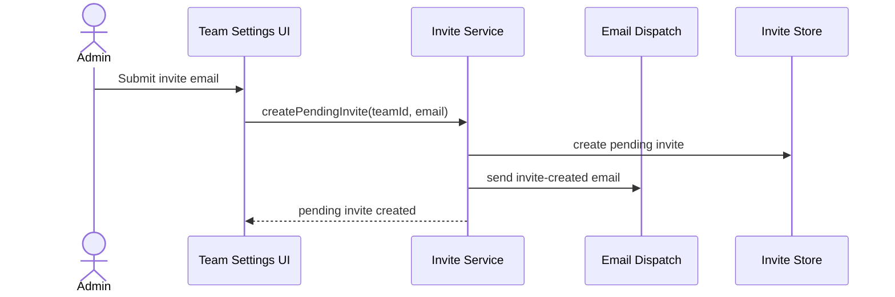

# Blueprint surface

## Purpose

The Blueprint surface captures architecture and system structure.

Use [contract.md](contract.md) for shared semantic authority entry
state, related semantic authority, update rules, and promotion paths.

It answers:

```text
How does this behavior fit into the system?
Where are the boundaries?
Which components talk to which?
What state transitions are allowed?
```

Blueprints are architecture authority when current.

## Typical contents

Blueprints can include:

- architecture diagrams
- use-case diagrams
- sequence diagrams
- state machines
- data flow diagrams
- interface contracts
- dependency maps
- build-vs-buy decisions
- integration boundaries

Blueprints are most valuable when work crosses components, touches sensitive
areas, introduces new state transitions, or creates dependency direction that
future agents must preserve.

A small tool can need Blueprint authority when several local surfaces must keep
a shared boundary. Examples include two interfaces sharing one service, a
parser and renderer with a one-way dependency, or a storage boundary that must
remain the only place where persistence is opened.

Blueprints should be machine-readable where possible. Mermaid diagrams,
structured YAML, and explicit state models are easier for agents to retrieve
and reason over than image-only diagrams.

## Contract focus

Blueprint entries should expose:

```text
primary question: how this fits into the system
owned meaning: structure, sequence, state, dependency shape, interfaces, and
architecture boundaries
common references: Context rationale, Intent behavior, Assurance obligations,
Description ownership, and target surfaces
```

Update Blueprint when architecture, state transitions, dependencies, interfaces,
or cross-component flows change. Keep local implementation responsibility in
Description.

## Example

```yaml
blueprint:
  id: "blueprint.team-invite-create-flow"
  surface: "blueprint"
  state: "current"
  scope: "team invite creation flow"
  current_meaning: "Team invite creation flows from the Team Settings UI through the Invite Service, Invite Store, and Email Dispatch. Billing seat allocation is outside this flow."
  retrieval_keys:
    - "product_area:teams"
    - "flow:create-team-invite"
    - "boundary:billing-outside-invite-create"
  target_references:
    - "Team Settings UI"
    - "Invite Service"
    - "Invite Store"
    - "Email Dispatch"
  related_surfaces:
    - "intent.team-invites.create"
    - "assurance.team-invites.no-seat-allocation-on-create"
    - "description.team-invite-service"
  supersedes: []
  superseded_by: ""
  updated_at: "YYYY-MM-DD"
```


